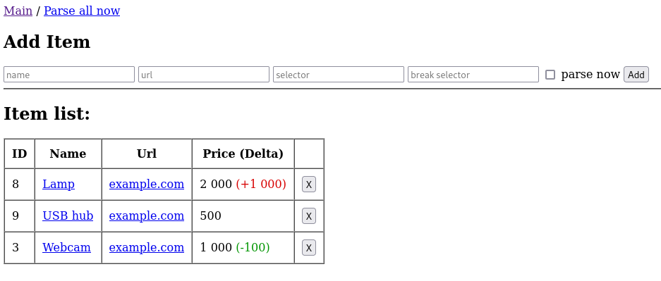

# Smart tracker

An application for value monitoring. Monitors value changes and displays them as a graph.

### Application features:

* Web interface.
* Keeping a history of value changes.
* Displaying value changes on the chart.
* Automatic start of the collector.
* Manual start of the collector.
* Launch in service mode.

## Screenshots

### Main page:


### Detail view:


Usage
------------

- Add item name.
- Add http url.
- Add css selector of html page.
- Add css break selector of html page, in the presence of which the value will not be processed.


Requirements
------------

Java JDK 17


Installation
------------

```bash
$ git clone https://github.com/chiefss/smart-tracker
$ cd smart-tracker
$ mvn clean package
```

Jar file will be created in the directory <project directory>/target.


Configuration
------------
Create application-custom.yml in the same directory as the smart-tracker-0.0.1-SNAPSHOT.jar 

#### Address:

```bash
app:
  address: 127.0.0.1
```

#### Port:

```bash
app:
  port:8080
```

#### Database path:

```bash
app:
  database:
    path=./smart-tracker.db
```

#### Authenticate:

Default username is "user"

Default password is random and is printed at console when the application starts

```bash
app:
  username: <username>
  password: <your password or empty>
```

#### Enable email reports:
```bash
app:
  mail:
    enabled: true
```

#### Email for reports:

```bash
app:
  mail:
    admin: no-reply@example.com
```

#### SMTP settings:

```bash
app:
  mail:
    from: me@example.com
    host: example.com
    username: me
    password: password
```


Simply run:
------------

```bash
$ java -jar ./target/smart-tracker-0.0.1-SNAPSHOT.jar
```

Run web browser http://localhost:8080


Run as service (systemd)
------------
Create service:

```bash
$ sudo vim /etc/systemd/system/smart-tracker.service
```

Replace EXAMPLE to correct username

```bash
[Unit]
Description=Smart Tracker Java Service

[Service]
User=<your username>
WorkingDirectory=<path to jar application>
ExecStart=java -jar smart-tracker-0.0.1-SNAPSHOT.jar
TimeoutStopSec=10
Restart=on-failure
RestartSec=5

[Install]
WantedBy=multi-user.target
```

### Run service

```bash
$ sudo systemctl start smart-tracker.service
```

### Show log service

```bash
$ sudo systemctl status smart-tracker.service
```

or

```bash
$ sudo journalctl -u smart-tracker
```

or realtime updates

```bash
$ sudo journalctl -u smart-tracker -f
```

### Enable autorun

```bash
$ sudo systemctl enable smart-tracker.service
```

# Web application

Run web browser http://localhost:8080
